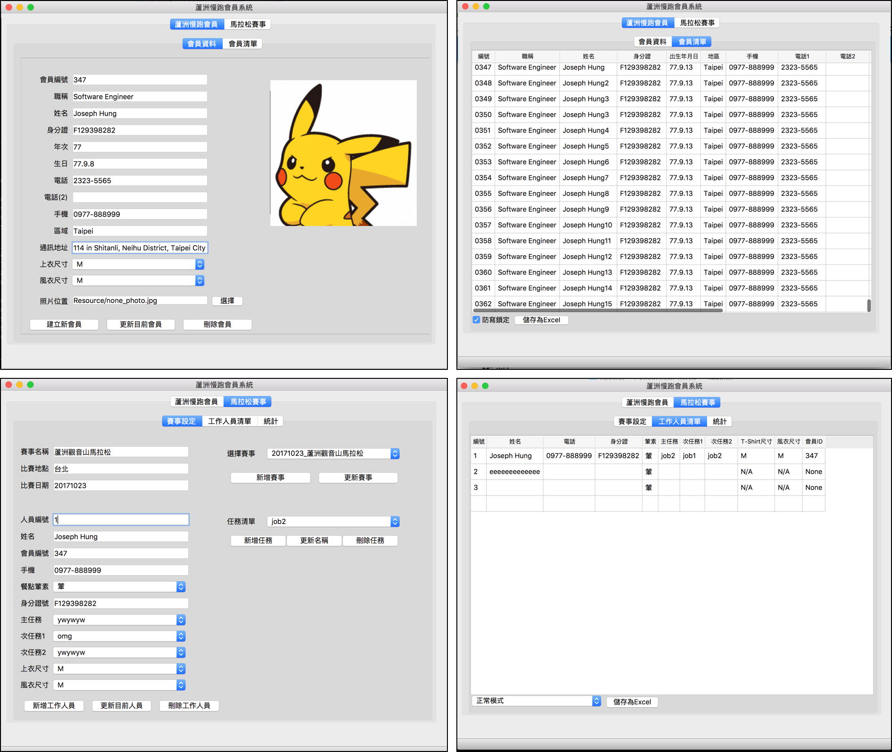

## Running Club Member System
Draft version


### Environment & Depent Modules
* Python 3.6.1
* PyQt5 (V5.8.1)
* Pyrebase
* Openpyxl

### Installation (Constructing...)

### Windows
1. Python 3.6.1 - Download release binary from website:

	```bash
   https://www.python.org/downloads/release/python-361/
   ```
2. PyQt5 - After install Python 3.6.1, run the below commands:

   ```bash
   pip3 install pyqt5
   One could check PyQt5 version with following code:
     from PyQt5.QtCore import QT_VERSION_STR
     from PyQt5.Qt import PYQT_VERSION_STR
     from sip import SIP_VERSION_STR

     print( "QT Ver: ", QT_VERSION_STR )
     print("SIP Version: ", SIP_VERSION_STR )
     print( "PyQt Version: ", PYQT_VERSION_STR )

   The results are as follows,
        >>> print( "QT Ver: ", QT_VERSION_STR )
        QT Ver:  5.8.0
        >>> print("SIP Version: ", SIP_VERSION_STR )
        SIP Version:  4.19.1
        >>> print( "PyQt Version: ", PYQT_VERSION_STR )
        PyQt Version:  5.8.1
   ```

### Start
1. Create a project on Firebase.
2. Fillup firebase config file which could refer to firebase_config.json.sample. Place the corresponding key under the project root folder.
3. Start from command line:
   $ python3 main_frb.py

### TODO
1. Redesign a better way to handle data without querying from firebase every operation.
2. Learn how to manipulate QtTableWidget to implement more user friendly interface.
3. Think/discuss a way with user to implement functions/pages for each running activity.
4. Think how to build standalone executive file of windows for compatibility. (cx_Freeze/pyinstaller...but both of them have bugs and can't build successfully.)

